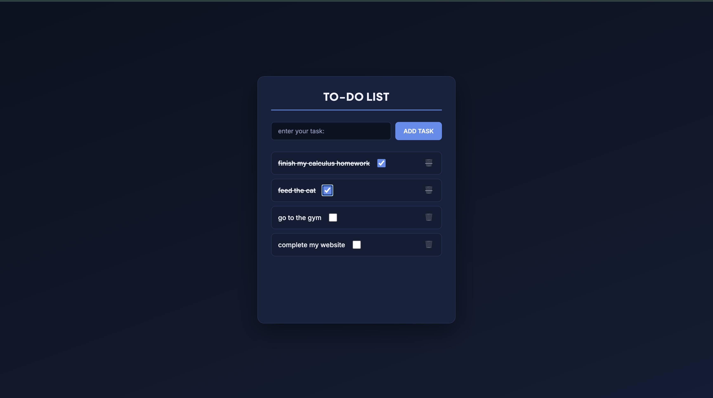

# To-Do List

A simple, clean to-do list app built with vanilla HTML, CSS, and JavaScript.

🔗 **Live demo:** [(https://github.com/Yazan-Ardah/TO-DO-LIST)]

## Features

- Add tasks via input field or pressing the Add Task button
- Mark tasks complete with a checkbox (adds strikethrough)
- Delete tasks with one click
- Input automatically focuses on page load for fast task entry

## Built with

- HTML5
- CSS3 (Flexbox, CSS variables)
- Vanilla JavaScript (DOM manipulation, event listeners)

## What I learned

This was my first web development project. I learned how to dynamically
create and append DOM elements, attach event listeners to elements created
at runtime, and debug issues like undefined variable references. I used AI
assistance for CSS styling and to help debug a few JavaScript errors.

## Future improvements

- Persist tasks using localStorage so they survive a page refresh
- Edit existing tasks
- Filter tasks by all / active / completed
